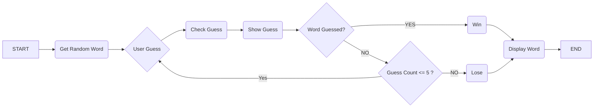

# flow.md

```mermaid
---
Title: wydle.py
---
flowchart LR
    A[START] --> B(Get Random Word)
    B --> C{User Guess}
    C --> D(Check Guess)
    D --> F(Show Guess)
    F --> G{Word Guessed?}
    G --> |YES| H(Win) --> Y(Display Word)
    G --> |NO| I{Guess Count <= 5 ?} 
    I --> |Yes| C
    I --> |NO| J(Lose) --> Y(Display Word)
    Y --> Z[END]
```
